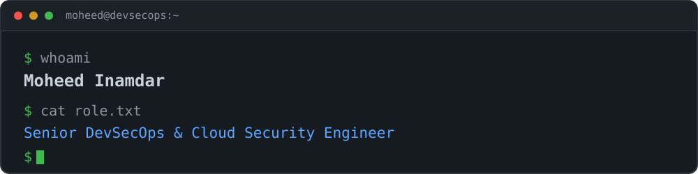
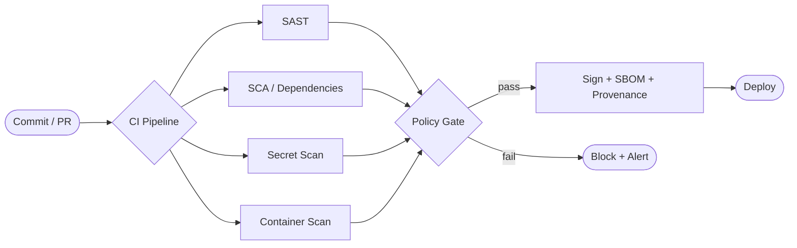

<div align="center">

# Hey, I'm Moheed! 

### Senior DevSecOps & Cloud Security Engineer · 7+ Years · Securing Developer Platforms at Enterprise Scale

[](https://linkedin.com/in/moheedinamdar)
[](https://github.com/moheedinamdar)
[](https://moheedinamdar.github.io/)
[](mailto:moheedinamdar@gmail.com)


</div>


## About Me

```yaml
apiVersion: platform.engineering/v1
kind: SeniorEngineer
metadata:
  name: Moheed Inamdar
  namespace: pune-maharashtra
  labels:
    role: Senior DevSecOps & Cloud Security Engineer
    company: Globant (Client: Roche - GxP regulated)
    experience: "7+ years"
    started: "January 2019"
spec:
  summary: |
    Enterprise-scale DevSecOps and Cloud Security Engineer architecting
    security-first developer platforms across 300+ orgs, 180K+ repos,
    and 5K+ groups in regulated industries (pharma, healthcare,
    cybersecurity). Shifted the enterprise from opt-in to
    enforced-by-default scanning (~100% pipeline coverage), cut CI/CD
    onboarding by ~60%, and built enterprise-adopted security metrics
    platforms used by 100+ product owners.
  currentFocus:
    - Software Supply Chain Security (SLSA, SBOM, Sigstore/cosign)
    - Internal Developer Platforms (Backstage, golden-path templates)
    - Policy-as-Code (OPA, Kyverno) and Kubernetes Security
    - AI-Augmented DevSecOps (LLM-driven vulnerability triage, RAG)
    - LLMOps reference architectures on Kubernetes
  openTo:
    roles:
      - Staff / Principal DevSecOps Engineer
      - Platform Engineering Lead (IC track)
      - Cloud Security Architect
    locations: [Pune, Hyderabad, UAE, Singapore, Remote]
  certifications:
    earned:
      - AWS Certified Developer – Associate (recertifying 2026)
    inProgress:
      - CKA (Certified Kubernetes Administrator)
  education:
    - B.E. in Computer Engineering — Pune University (2015–2018)
```


## Secure SDLC at Enterprise Scale




## Career Journey (Jan 2019 – Present)

```
2019           2020              2024              2026 →
 │              │                 │                 │
 ├──────────────┼─────────────────┼─────────────────┤
 │ CenturySoft  │ Zymr (Virsec)   │ Globant (Roche) │ Staff / Principal
 │ Associate    │ Senior DevOps   │ Sr. DevSecOps & │ DevSecOps /
 │ Developer    │ Engineer (Lead) │ Cloud Security  │ Platform Architect
 ├──────────────┼─────────────────┼─────────────────┤
   AWS · Jenkins  Docker · K8s ·    DevSecOps at        Supply chain security,
   Python · ETL   Terraform ·       enterprise scale —  IDPs (Backstage),
   Cloud Migrate  Container Sec     180K+ repos,        LLMOps,
                  shift-left sec    300+ orgs,          AI-augmented security
                  pipelines         ~100% scan coverage
```


## Featured Projects

> A few things I'm actively building and documenting in public.

| Project | Description | Status |
|---------|-------------|--------|
| **[Supply Chain Security Pipeline](https://github.com/moheedinamdar/supply-chain-security-pipeline)** | SLSA Level 3 + SBOM (Syft) + vulnerability scanning (Grype) + Sigstore cosign signing + Kyverno admission verification on EKS | Building |
| **[AI Vulnerability Triage](https://github.com/moheedinamdar/ai-vulnerability-triage)** | LangChain + LLM + RAG over CVE/EPSS data for auto-prioritization and de-duplication of SAST/SCA findings | Building |

<div align="center">

<a href="https://github.com/moheedinamdar/supply-chain-security-pipeline"></a>
<a href="https://github.com/moheedinamdar/ai-vulnerability-triage"></a>

</div>


## Tech Stack & Expertise

<div align="center">

### Cloud & Infrastructure


### Containers & Orchestration


### CI/CD & GitOps


### Security Scanning (SAST · DAST · SCA · Container · IaC)


### Supply Chain Security & Policy-as-Code (building in public)


### Secrets & Identity


### Observability


### Platform Engineering & AI (learning)


### Languages & Scripting


</div>


## Key Achievements

<table>
<tr>
<td width="50%">

**At Globant — Client: Roche (2024–Present)**

- Architected **Unified Security Metrics Platform** (Python/GraphQL/DuckDB/Grafana) adopted enterprise-wide
- Owned security posture across **300+ orgs · 180K+ repos · 5K+ groups**
- Drove security scanning from opt-in to enforced-by-default (~100% pipeline coverage)
- Designed reusable secure CI/CD templates cutting onboarding by **~60%**
- Built internal security dashboard empowering **100+ product owners**
- Led team of 3 engineers · 15+ enablement sessions

</td>
<td width="50%">

**At Zymr — Client: Virsec (2020–2024)**

- Shifted security left, catching the majority of vulnerabilities pre-staging
- Hardened **50+ Docker images** against CIS Benchmarks
- Reduced infra provisioning time by **70%** with serverless architecture
- Designed DR & high availability (multi-AZ) on AWS Well-Architected
- Led microservices migration, mentoring 10+ developers
- Core member of Virsec product security research team

</td>
</tr>
</table>


## Awards & Recognition

| Award | Year | Details |
|-------|------|---------|
| **Pat on the Back Award** — Globant | 2024 | Recognized for leading the internal security dashboard & reporting system, driving cross-functional innovation in security automation |
| **Hackathon Winner (2nd Place)** — Zymr | 2023 | Built an AI-powered NLP summarization system using synthetic and open datasets — foundation for current AI-augmented security work |


## GitHub Stats

<div align="center">


</div>


## Currently

- Architecting enterprise security frameworks at **Globant (Roche / GxP regulated)**
- Building open-source work around **supply chain security** and **AI-augmented DevSecOps**
- Working toward **CKA** (Certified Kubernetes Administrator)
- Writing about DevSecOps and platform engineering at scale; articles are on the way for Medium and Dev.to
- **Open to Staff / Principal DevSecOps · Platform Engineering Lead · Cloud Security Architect** roles in Pune, Hyderabad, UAE, Singapore, or Remote


<div align="center">

### Let's Connect

**Open to collaborating on DevSecOps, Platform Engineering, Software Supply Chain Security, and Cloud Security projects.**

[](mailto:moheedinamdar@gmail.com)
[](https://linkedin.com/in/moheedinamdar)
[](https://moheedinamdar.github.io/)


</div>
